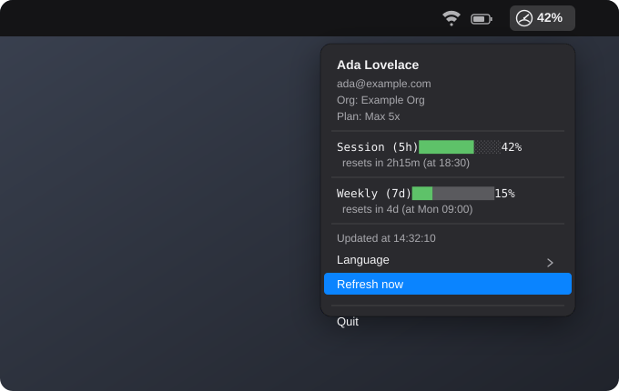

# ClaudeUsageBar

A tiny, native macOS menu bar app that shows who you're logged in as with
[Claude Code](https://claude.com/claude-code) and how much of your usage
window you've burned through — session (5h) and weekly — without opening a
terminal or the Claude Console.

No Electron, no background daemon, no third-party dependencies. A small
Swift Package (`swift build`), running as a plain `NSStatusItem`.

<p align="center">
  
  <br>
  <sub>Illustrative mockup with sample data — not a live screenshot.</sub>
</p>

## Why

Claude Code CLI already tracks your usage internally, but the only way to see
it is to ask the assistant or dig through the CLI. This app surfaces the same
data — account identity and 5h/7d rate-limit usage — as a glanceable menu bar
icon that updates on its own.

## Features

- **Native menu bar icon** — SF Symbol gauge (`gauge.with.needle`) whose
  needle position tracks your 5h usage percentage, the same idiom macOS uses
  for its own battery icon. Turns red automatically once you're above 90%.
- **Account identity at a glance** — display name, email, organization, and
  plan (e.g. `Pro`, `Max 5x`, `Max 20x`) shown at the top of the dropdown.
- **Session (5h) and weekly (7d) usage bars**, each with a countdown to reset.
- **Auto-refresh every 60 seconds**, plus a manual "Refresh now" menu item.
- **No Dock icon** — pure menu bar utility (`LSUIElement` behavior via
  `NSApplication.ActivationPolicy.accessory`).
- **Optional autostart at login** via a per-user `LaunchAgent` — no `sudo`,
  fully reversible.
- **English / Português (BR) toggle**, from the dropdown's *Language* submenu
  — independent of the macOS system language, persisted across restarts.

## How it works

The app reads two things that are already on your Mac, both **read-only**:

1. **Account identity** — `~/.claude.json` → the `oauthAccount` object that
   the Claude Code CLI writes after you log in (`displayName`, `emailAddress`,
   `organizationName`, `organizationType`).
2. **OAuth access token** — the macOS login Keychain, generic-password item
   named `Claude Code-credentials`, which is exactly what `claude` itself
   reads and writes. Retrieved via the built-in `/usr/bin/security` tool —
   no third-party Keychain library.

With that access token, it calls the same (undocumented, but stable) endpoint
the official CLI uses:

```
GET https://api.anthropic.com/api/oauth/usage
Authorization: Bearer <access_token>
anthropic-beta: oauth-2025-04-20
User-Agent: claude-code/<version>
```

...and renders `five_hour` / `seven_day` utilization as the menu bar icon and
dropdown bars.

**The app never writes anything back** — not to the Keychain, not to
`~/.claude.json`, not to disk anywhere. If the access token has expired and a
refresh token is available, it refreshes in memory just for that one request;
the rotated token is *not* persisted, so it can never interfere with the
Claude Code CLI's own credential state.

## Project structure

A standard Swift Package, no Xcode project file needed:

```
ClaudeUsageBar/
├── Package.swift
└── Sources/ClaudeUsageBar/
    ├── App.swift                    # @main entry point (NSApplicationDelegate)
    ├── Models/
    │   ├── ClaudeAccount.swift      # ~/.claude.json → oauthAccount
    │   ├── OAuthCredentials.swift   # Keychain credential shape + plan label
    │   └── UsageResponse.swift      # /api/oauth/usage response shape
    ├── Credentials/
    │   ├── CredentialsStore.swift   # read-only Keychain + ~/.claude.json access
    │   └── ClaudeCLI.swift          # shells out to `claude --version`
    ├── Networking/
    │   └── AnthropicUsageAPI.swift  # usage fetch + token refresh
    ├── Formatting/
    │   └── UsageFormatter.swift     # pure percent/date/text-bar formatting
    ├── Localization/
    │   ├── AppLanguage.swift        # EN / PT-BR toggle, persisted in UserDefaults
    │   └── L10n.swift               # every user-facing string, in one place
    └── UI/
        ├── MenuBarIcon.swift        # SF Symbol gauge rendering
        ├── UsageMenuBuilder.swift   # NSMenu construction (pure function of state)
        └── StatusBarController.swift # NSStatusItem owner, timer, orchestration
```

Each layer has one job: `Models` only decode JSON, `Credentials`/`Networking`
only do I/O, `Formatting` is pure functions, `Localization` is a dictionary
lookup, and `UI` is the only layer allowed to touch AppKit state.
`StatusBarController` is the sole piece that mutates anything — everything
else is a value type or a stateless `enum` namespace.

## Requirements

- macOS 12+ (Monterey or later). The animated gauge needle requires macOS 13+;
  on older versions the icon is still shown, just static.
- Xcode Command Line Tools, for the Swift toolchain (`xcode-select --install`).
- The [`claude`](https://claude.com/claude-code) CLI, run at least once so
  your OAuth credentials exist in the Keychain and `~/.claude.json` has your
  account info.

## Build & run

```bash
git clone https://github.com/andersonzeroone/ClaudeUsageBar.git
cd ClaudeUsageBar
./build.sh          # swift build -c release -> ./claude-usagebar
./claude-usagebar &  # appears in the menu bar, no Dock icon
```

On first launch, macOS will likely ask for permission to access the
`Claude Code-credentials` Keychain item — click **Allow** (or **Always
Allow**). Since the binary isn't code-signed, this can reappear after each
rebuild; if Gatekeeper complains, right-click the binary in Finder → **Open**
once.

## Start automatically at login (optional)

```bash
./install-agent.sh   # installs a per-user LaunchAgent (RunAtLoad)
./uninstall-agent.sh # removes it
```

`install-agent.sh` copies the built binary to
`~/Library/Application Support/ClaudeUsageBar/` and points the LaunchAgent
there — **not** at this repo checkout. That means you can delete this
cloned/built folder afterwards and the menu bar app keeps running and
restarting at every login. To deploy a change, rebuild (`./build.sh`) and
re-run `./install-agent.sh` from a checkout; `./uninstall-agent.sh` removes
both the LaunchAgent and the installed copy.

Only touches `~/Library/Application Support` and `~/Library/LaunchAgents` —
no `sudo`, no system-wide changes, fully reversible.

## Privacy & security

- **Nothing is sent anywhere except Anthropic's own API**, using your own
  existing OAuth token — the same one the `claude` CLI already uses.
- **Nothing is written to disk.** No cache, no log file, no local database.
- **Nothing is hardcoded or embedded per-user.** The OAuth `client_id` in the
  source is Anthropic's public Claude Code CLI client ID (not a secret — it's
  the same one the official CLI ships with, used with the standard OAuth
  authorization-code + PKCE flow).
- Cloning and running this on a different Mac just shows *that* Mac's own
  logged-in Claude account — there's no way to read someone else's
  credentials or usage through this app.

## Limitations

- Anthropic/Claude only — for other providers (OpenAI, Z.AI, OpenRouter,
  etc.) see the multi-vendor project this was inspired by.
- If your access token is expired and the CLI left an empty refresh token
  (the newer "trusted device" flow), the app shows "session expired" until
  you run `claude` again.
- Not code-signed / notarized. This is a small local utility you build
  yourself, not a distributed binary.

## Acknowledgements

Architecture (Keychain access pattern, the `/api/oauth/usage` endpoint, the
refresh-token flow) is based on
[akitaonrails/ai-usagebar](https://github.com/akitaonrails/ai-usagebar), a
much more complete multi-vendor (Claude, OpenAI, Z.AI, OpenRouter, DeepSeek,
Kimi, and more) usage bar for Waybar, GNOME Shell, and macOS. This project is
a deliberately minimal, single-vendor reimplementation in native Swift with
no external dependencies.

## License

No license has been chosen yet — all rights reserved by default until one is
added. Open an issue if you'd like this under MIT/Apache-2.0.
